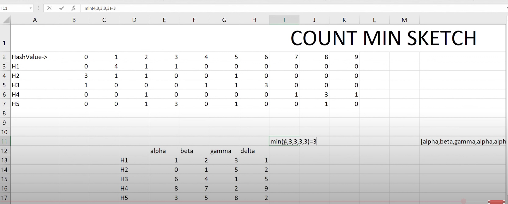

# Count-Min Sketch (CMS) in System Design

**Count-Min Sketch (CMS)** is a **probabilistic data structure** used in **system design** for estimating the frequency of elements in a data stream **with sublinear space complexity**. It’s especially useful in **large-scale systems** where exact counting is too expensive (e.g., traffic monitoring, spam detection, or tracking search queries).

---

## 🔹 How It Works (High-Level)
- Uses a **2D array of counters** and **multiple hash functions**.
- Each incoming item is hashed several times (once per hash function), and the corresponding counters are incremented.
- To estimate the frequency of an item, it’s hashed again, and the **minimum of the corresponding counters** is returned (hence, “count-min”).

---

## ✅ Advantages
- **Space-efficient** – Uses far less memory than storing full counts.
- **Fast updates & queries** – O(1) time for both.
- **Linear scalability** – Works well with parallel or distributed implementations.
- **No need to store items** – Saves space and can preserve privacy.
- **Approximation guarantees** – Errors are bounded and tunable via parameters (width and depth of the sketch).

---

## ❌ Disadvantages
- **Overestimates frequencies** – Due to hash collisions (never underestimates).
- **No item deletion** – You can only increment; decrementing may corrupt estimates.
- **No value for zero counts** – Cannot tell if an item was never seen or just had low frequency.
- **Requires good hash functions** – Poor hashing increases error rate.
- **Probabilistic** – Not suitable when exact counts are necessary.

---

## 📌 Common Use Cases in System Design
- Web analytics (e.g., page views per IP)
- Network monitoring (e.g., top talkers)
- Spam filtering (e.g., word frequency)
- Rate limiting
- Caching policies (e.g., identifying hot items)

---

## 🖼️ Diagram
*Insert diagram here illustrating Count-Min Sketch structure and query/update process.*

---

## 🔗 Reference
](https://youtu.be/NUCZcPXkPKY?si=prIwJPNECEiSW6Aj)

