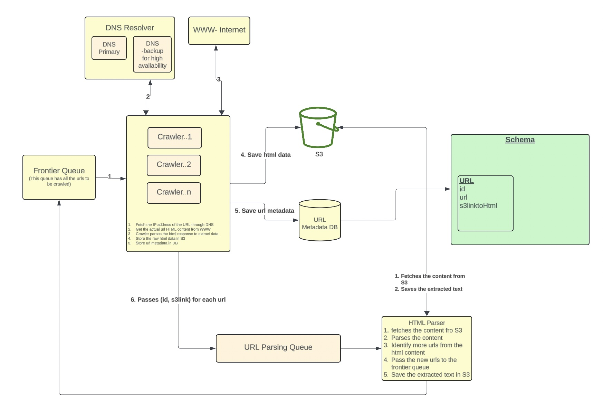

# Web Crawler

## Clarifying Questions to Ask

1. Are we crawling the entire web or specific domains, and are we dealing with potentially billions of pages ( entire web)?  
2. Are we building a search index, extracting data for analytics, training LLMs, or another purpose?  
3. Which page elements need to be collected (URLs, titles, meta tags, full text), and do we need OCR for images? or how to extract javascript loaded pages?
4. Must we respect robots.txt and other politeness constraints?  
5. How should we store or process data (raw HTML vs. parsed content), and do we need to resume from checkpoints?  
6. Is this a one-time crawl or a continuous process for updates?  

## Functional Requirements

1. Crawl URLs from an initial list of seed URLs
2. Store the webpage data
3. Extract additional URLs from the webpages and add them to the seed list

## Non functional Requirements

1. Must scale to handle the entire World Wide Web
2. Built-in fault tolerance
3. Schedule periodic updates to keep retrieved data current
4. Respect robots.txt for politeness

## Design Diagram

